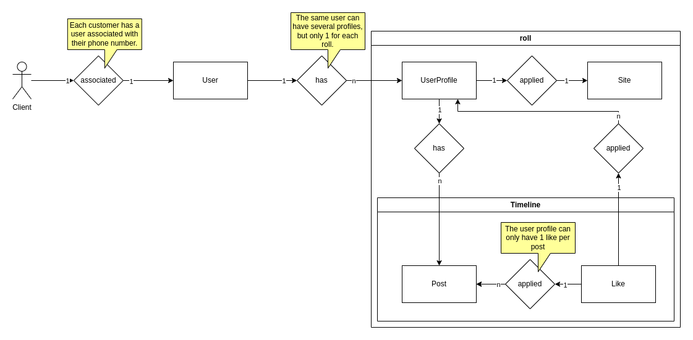
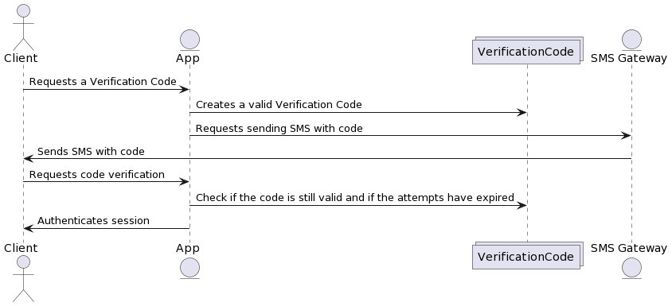
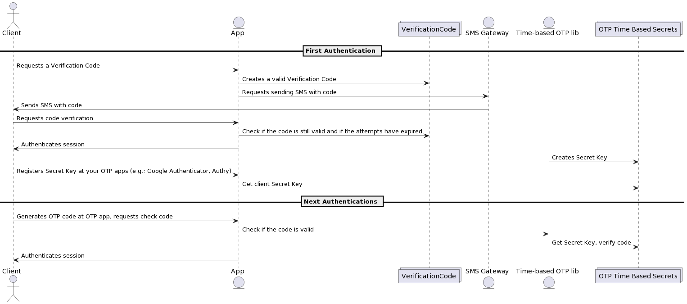
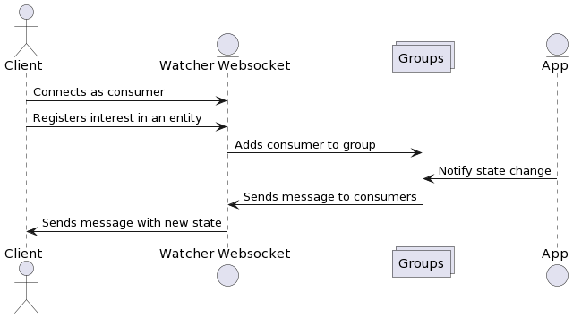
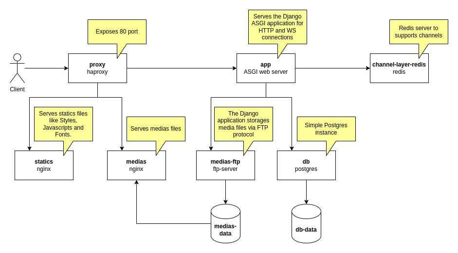

# roll social network

**social networks in their essence.**

Crie redes sociais em sua essência. Participe de comunidades "rolls" para consumir e compartilhar fotos. Interaja com outros usuários curtindo suas postagens.

**roll social network** é um projeto de código livre sob a licença [MIT](LICENSE) desenvolvido com os frameworks [Django](https://www.djangoproject.com/) e [Vue](https://vuejs.org/).

*in English:*

Create social networks in their essence. Join communities "rolls" to consume and share photos. Interact with other users by liking their posts.

**roll social network** is an open source project under the [MIT](LICENSE) license developed with the [Django](https://www.djangoproject.com/) and [Vue](https://vuejs.org/) frameworks.


## Architecture

### Rolls, Social and Timeline

In our social network, a community unit is called **roll**. Users can join a **roll** by creating a profile on it. Once associated, the user has access to the timeline and can interact by liking other users' posts, as well as collaborating by publishing their own content.

Entity-relationship model:



### Auth

Access to our social network rolls requires authentication. To simplify and solve some problems, authentication linked to the customer's phone number was chosen.

UML Diagram:



Advantages of the chosen authentication model:

- Simplicity. The user does not need to set or remember a password or have a recovery email.
- Security. Access can only be done with the verification code sent at each login or by granting it to a third party.
- Real people. We guarantee, in most cases, that the clients is a real person and not a robot. With this we can also have legal applications, since the data uploaded to the social network can be linked to a real person.

#### OTP time-based

Users, after validating the time-based OTP code, can authenticate using just the code generated by the 2FA application.

UML Diagram:



### Watcher (WebSocket)

Watcher is a WebSocket solution for real-time state update.



### Protected Media with NGINX X-Accel

When the `MEDIA_PATH_AS_NGINX_ACCEL` flag is enabled, the `/media/` endpoint responds, for authenticated users, with the status code 201 and with the `X-Accel-Redirect` header. With this you can protect media files against unauthenticated users.

Read more about X-Accel in the [NGINX documentation](https://www.nginx.com/resources/wiki/start/topics/examples/x-accel/).

See the concept applied in the [NGINX media conf file](nginx.medias.default.conf).


## Run

### Development mode

Requirements:

- Python 3.12
- [pipenv](https://pipenv.pypa.io/en/latest/)
- Node.js 20.11

Init ui submodule:

```bash
$ git submodule init ui
$ git submodule update --init --recursive
```

Install dependencies:

```bash
$ pipenv install --dev
$ cd ui/ && npm install --include=dev
```

The default app settings are setted to run locally in development and watch mode.

Init database tables:

```bash
$ pipenv run dbmigrate
```

Run Django app web server in watch mode:

```bash
$ pipenv run dev
```

Build the Vue app and static style files running the ui package in watch mode:

```bash
$ cd ui/ && npm run watch
```

### Lint and Tests

Run [pylint](https://pylint.readthedocs.io/en/latest/):

```bash
$ pipenv run lint
```

Run [mypy](https://mypy-lang.org/) to check typing:

```bash
$ pipenv run check-typing
```

Run unit tests:

```bash
$ pipenv run tests
```

Run unit tests with code [coverage](https://coverage.readthedocs.io/):

```bash
$ pipenv run coverage
# print code coverage report
$ pipenv run coverage-report
```

### Local as Production

Using dockerization and the [Docker Compose definition](docker-compose.yml), you can up all containers and services required by roll social network as if it were in production mode.

```bash
$ docker compose up --build
```

Services diagram:




## Settings and Environment Vars

This project follow The [Twelve-Factor App](https://12factor.net/) methodology so all settings can be defined through environment variables.

All settings were centralized in the [settings.py](rollsocialnetwork/settings.py) file and can be defined by environment variables due to the [python-decople](https://pypi.org/project/python-decouple/) [config object](https://github.com/HBNetwork/python-decouple?tab=readme-ov-file#usage).
